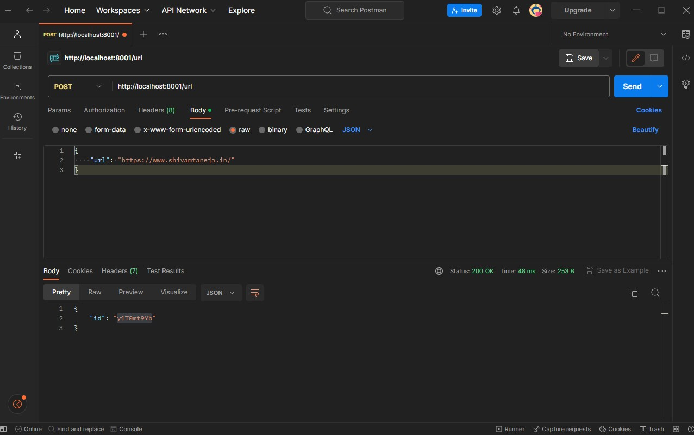
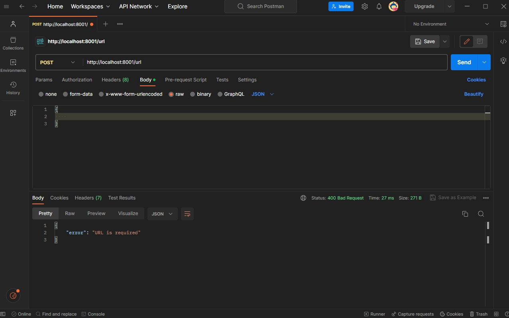
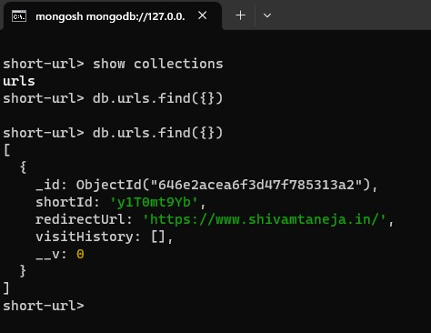
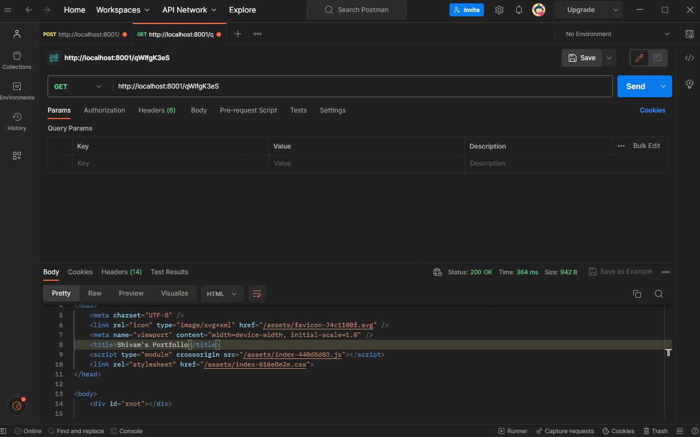
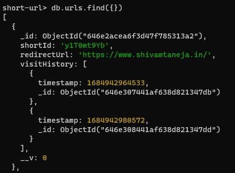

# URL Shortener
This is a URL shortener service that takes a valid URL as input and returns a shortened URL. When users visit the shortened URL, they are redirected to the original URL. The service also tracks the total number of visits or clicks on each shortened URL.

## Technologies Used

- Express
- Mogoose
- Short ID
- Nodemon

## Routes

- **POST /URL**
    Generates a new short URL. Use this route to create a new shortened URL by providing a valid URL in the 
    request.

    ### Providing Valid URL
    
    ### Providing Invalid URL
    

    ### Databse Storing the Valid URL Provided
    

- **GET /:id**
  Redirects the user to the original URL associated with the provided short ID. Use this route to visit the shortened URL and get redirected to the original URL.

  ### Screenshot demonstrating redirection from shortened URL
  

  ### Video demonstrating redirection from shortened URL
  

  ### Databse Storing the Visit History
  

- **GET /URL/analytics/:id**
  Returns the number of clicks for the provided short ID. Use this route to get analytics information for a specific shortened URL.

## Credits

This was created by Shivam Taneja as a fun project to learn about Express.js

- Website: [Shivam Taneja](https://shivamtaneja.in)
- LinkedIn: [Shivam Taneja](https://www.linkedin.com/in/shivam-taneja/)

## Contributions

Contributions are welcome. If you want to contribute to this project, please fork the repository and submit a pull request.